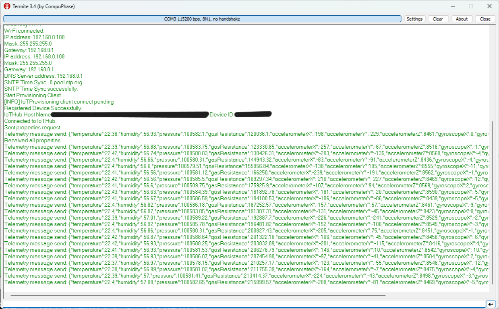
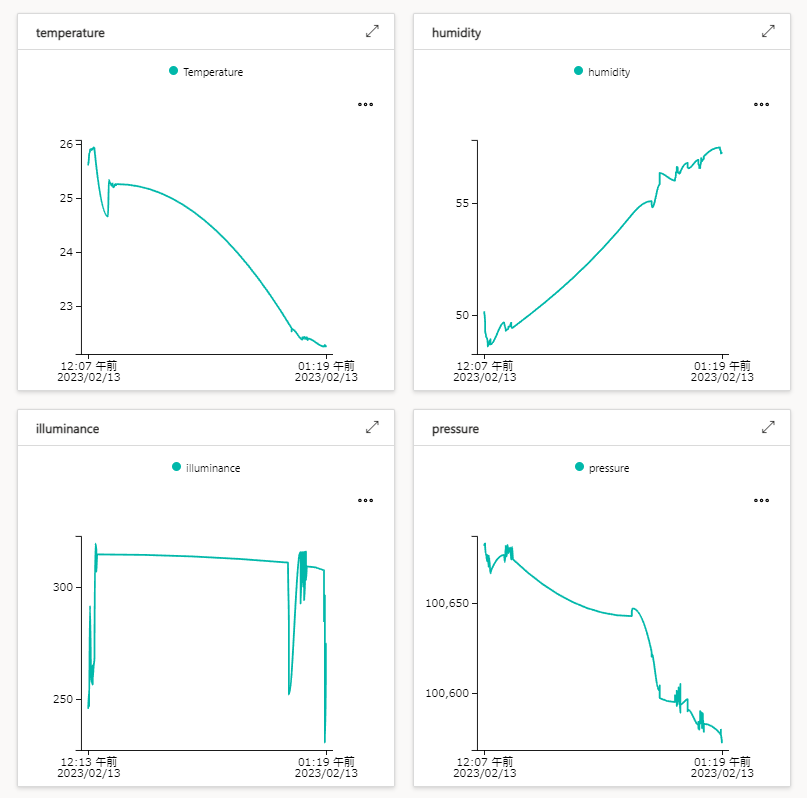

# Azure IoT Plug and Play sample for Renesas RX65N Cloud kit
## Requires
* e2studio 2022-07
* RDPv1.36
* AzureRTOS v.6.2.0(Download by Smart Configurator(e2studio))
* [RX65N Cloud Kit](https://www.renesas.com/us/en/products/microcontrollers-microprocessors/rx-32-bit-performance-efficiency-mcus/rx65n-cloud-kit-renesas-rx65n-cloud-kit) 

# 

## Terminal output

## IoT Central
* Graph 
